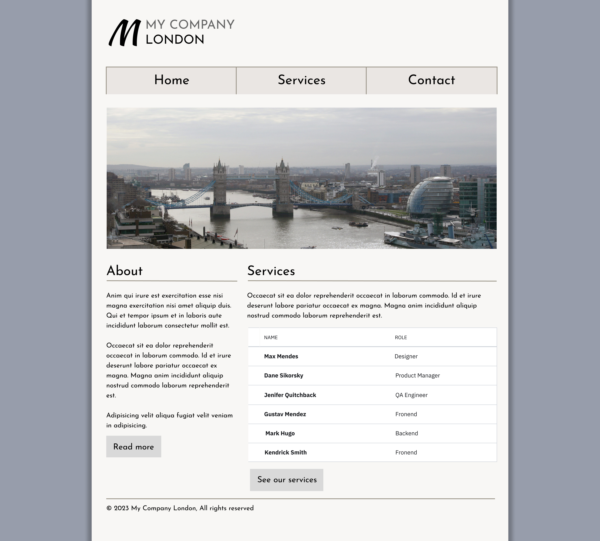
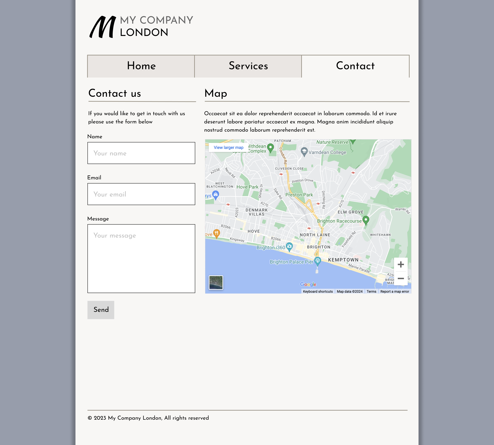
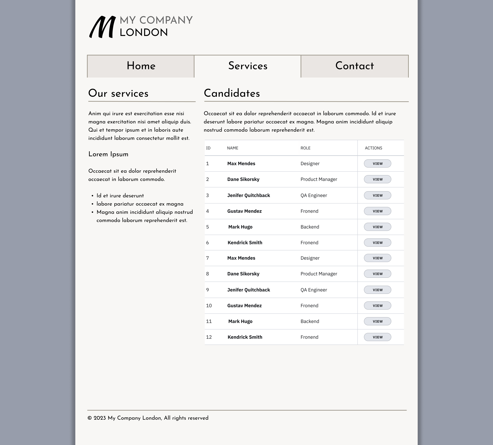

# HTML & CSS Layout Task

This was a small project where we were given a design and asked to recreate it using **HTML** and **CSS**.  
The goal was to get better at building layouts from a visual reference and to practise using semantic HTML and clean CSS.

## What I Used
- HTML  
- CSS  

## What I Learned
I got more comfortable with layout techniques (mainly flexbox), spacing, and following a design closely.

Design given:

